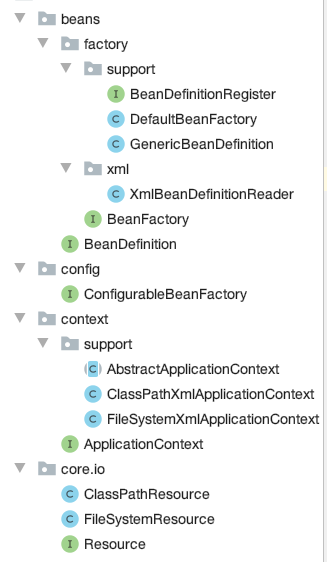

# Lite Spring
## 通过 xml 获取 bean
### 依赖
- junit
- dom4j

### 读取 xml 得到 BeanDefinition
```java
InputStream is = null;
    try {
        ClassLoader cl = ClassUtils.getDefaultClassLoader();
        is = cl.getResourceAsStream(configFile);
        SAXReader reader = new SAXReader();
        Document doc = reader.read(is);

        Element root = doc.getRootElement();
        Iterator iter = root.elementIterator();
        while (iter.hasNext()) {
            Element el = (Element) iter.next();
            String id = el.attributeValue(ID_ATTRIBUTE);
            String beanClassName = el.attributeValue(CLASS_ATTRIBUTE);
            BeanDefinition db = new GenericBeanDefinition(id, beanClassName);
            this.beanDefinitionMap.put(id, db);
        }

    }
```
### 通过反射获取 Bean
```java
BeanDefinition bd = this.getBeanDefinition(beanID);
    if (bd == null) {
        return null;
    }
    ClassLoader cl = ClassUtils.getDefaultClassLoader();
    String beanClassName = bd.getBeanClassName();
    try {
        Class<?> clz = cl.loadClass(beanClassName);
        return clz.getDeclaredConstructor().newInstance();
    }
```
### 自定义 Exception 

##  V2 代码重构 符合单一职责原则


`DefaultBeanFactory` 实现了 `BeanDefinitionRegister` 与 `BeanDefinitionRegister`

`xmlBeanDefinitionReader` 负责解析 xml 文件 并将其存入 `factory`

### 测试

```java
  @Test
    public void testGetBean(){
        DefaultBeanFactory factory = new DefaultBeanFactory();
        XmlBeanDefinitionReader reader = new XmlBeanDefinitionReader(factory);
        reader.LoadBeanDefinitionReader("petstore-v1.xml");

        BeanDefinition definition = factory.getBeanDefinition("petStore");
        Assert.assertEquals("de.o0o0o0.service.v1.PetStoreService", definition.getBeanClassName());

        PetStoreService service = (PetStoreService) factory.getBean("petStore");
        Assert.assertNotNull(service);
    }
```


##  V3 实现 ClassPathXmlApplicationContext


V3 在 v2 的基础上 增加 `context` 包 `ApplicationContext` 继承了 `BeanFactory` 接口(拥有 getBean 方法)

`ClassPathXmlApplicationContext` 实现了 `ApplicationContext` 接口

### ClassPathXmlApplicationContext

```java
public class ClassPathXmlApplicationContext implements ApplicationContext {
    private DefaultBeanFactory factory = null;

    public ClassPathXmlApplicationContext(String configFile) {
        factory = new DefaultBeanFactory();
        XmlBeanDefinitionReader reader = new XmlBeanDefinitionReader(factory);
        reader.LoadBeanDefinitionReader(configFile);
    }
    @Override
    public Object getBean(String beanID) {
        return factory.getBean(beanID);
    }
}
```

### 测试

```java
    @Test
    public void testGetBean(){
        ApplicationContext ctx = new ClassPathXmlApplicationContext("petstore-v1.xml");
        PetStoreService storeService = (PetStoreService) ctx.getBean("petStore");
        Assert.assertNotNull(storeService);
    }
```

至此，使用方法就和原生 spring 差不多了。


## V4 实现不同的文件读取方法


增加了用于读取文件的 `Resource` 接口 放在 `core.io` 包下 

### #1 修改 xmlBeanDefinitionReader 

```java
public class XmlBeanDefinitionReader {
    private static final String ATTRIBUTE_ID = "id";
    private static final String ATTRIBUTE_CLASS = "class";
    private BeanDefinitionRegister register;

    public XmlBeanDefinitionReader(BeanDefinitionRegister register) {
        this.register = register;
    }
    public void LoadBeanDefinitionReader(Resource resource){
        InputStream inputStream = null;
        try {
            inputStream = resource.getInputStream();
        } catch (FileNotFoundException e) {
            e.printStackTrace();
        }
        SAXReader reader = new SAXReader();
        try {
            Document doc = reader.read(inputStream);

            Element root = doc.getRootElement();
            Iterator iterator = root.elementIterator();
            while (iterator.hasNext()) {
                Element el = (Element) iterator.next();
                String id = el.attributeValue(ATTRIBUTE_ID);
                String beanClassName = el.attributeValue(ATTRIBUTE_CLASS);
                BeanDefinition bd = new GenericBeanDefinition(id, beanClassName);
                this.register.registerBeanDefinition(id, bd);
            }
        } catch (Exception e) {
            throw new BeanDefinitionStoreException("load configFile failed", e);
        } finally {
            if (inputStream != null) {
                try {
                    inputStream.close();
                } catch (IOException e) {
                    e.printStackTrace();
                }
            }
        }
    }
}

```

### #2 ClassPathResource

```java
public class XmlBeanDefinitionReader {
    private static final String ATTRIBUTE_ID = "id";
    private static final String ATTRIBUTE_CLASS = "class";
    private BeanDefinitionRegister register;

    public XmlBeanDefinitionReader(BeanDefinitionRegister register) {
        this.register = register;
    }
    public void LoadBeanDefinitionReader(Resource resource){
        InputStream inputStream = null;
        try {
            inputStream = resource.getInputStream();
        } catch (FileNotFoundException e) {
            e.printStackTrace();
        }
        SAXReader reader = new SAXReader();
        try {
            Document doc = reader.read(inputStream);

            Element root = doc.getRootElement();
            Iterator iterator = root.elementIterator();
            while (iterator.hasNext()) {
                Element el = (Element) iterator.next();
                String id = el.attributeValue(ATTRIBUTE_ID);
                String beanClassName = el.attributeValue(ATTRIBUTE_CLASS);
                BeanDefinition bd = new GenericBeanDefinition(id, beanClassName);
                this.register.registerBeanDefinition(id, bd);
            }
        } catch (Exception e) {
            throw new BeanDefinitionStoreException("load configFile failed", e);
        } finally {
            if (inputStream != null) {
                try {
                    inputStream.close();
                } catch (IOException e) {
                    e.printStackTrace();
                }
            }
        }
    }
}
```

## #3 FileSystemResource

```java
public class FileSystemResource implements Resource {
    private final String path;
    private final File file;

    public FileSystemResource(String path) {
        Assert.notNull(path, "Path must be not null");
        this.path = path;
        this.file = new File(path);
    }

    @Override
    public InputStream getInputStream() throws FileNotFoundException {
        return new FileInputStream(file);
    }

    @Override
    public String getDescription() {
        return "file [" + this.file.getAbsolutePath() + "]";
    }
}
```


### #4  ClassPathXmlApplicationContext

```java
public class ClassPathXmlApplicationContext implements ApplicationContext {
    private DefaultBeanFactory factory;

    public ClassPathXmlApplicationContext(String configFile) {
        factory = new DefaultBeanFactory();
        Resource resource = new ClassPathResource(configFile);
        XmlBeanDefinitionReader reader = new XmlBeanDefinitionReader(factory);
        reader.LoadBeanDefinitionReader(resource);
    }
    @Override
    public Object getBean(String beanID) {
        return factory.getBean(beanID);
    }
}
```

### #5 测试

```java
    @Test
    public void testClassPathResource() {
        ApplicationContext ctx = new ClassPathXmlApplicationContext("petstore-v1.xml");
        PetStoreService storeService = (PetStoreService) ctx.getBean("petStore");
        Assert.assertNotNull(storeService);
    }
    @Test
    public void testFileSystemResource() {
        ApplicationContext ctx = new FileSystemXmlApplicationContext("/Users/d.glua/IdeaProjects/liteSpring/src/test/resources/petstore-v1.xml");
        PetStoreService storeService = (PetStoreService) ctx.getBean("petStore");
        Assert.assertNotNull(storeService);
    }
```

## V5

V4 中两个 applicationContext 的实现有大块的重复代码，可以用模版方法抽象出一个新类 `AbstractApplicationContext` 

### #AbstractApplicationContext

```java
public abstract class AbstractApplicationContext implements ApplicationContext {

    private DefaultBeanFactory factory;

    public AbstractApplicationContext(String path) {
        factory = new DefaultBeanFactory();
        Resource resource = this.getResourceByPath(path);
        XmlBeanDefinitionReader reader = new XmlBeanDefinitionReader(factory);
        reader.LoadBeanDefinitionReader(resource);
    }

    abstract Resource getResourceByPath(String path);

    @Override
    public Object getBean(String beanID) {
        return factory.getBean(beanID);
    }
}

```

### #ClassPathXmlApplicationContext

```java
public class ClassPathXmlApplicationContext extends AbstractApplicationContext {
    public ClassPathXmlApplicationContext(String path) {
        super(path);
    }

    @Override
    Resource getResourceByPath(String path) {
        return new ClassPathResource(path);
    }
}
```

如此，让整个代码无比清爽


## ClassLoader 问题

前几个版本中 classLoader 都是由 ClassUtils 中写死的 ClassLoader 这样并不好


Spring 添加了一个 ConfigurableBeanFactory 接口使 factory 拥有可配置性

### # DefaultBeanFactory

```java
public class DefaultBeanFactory implements ConfigurableBeanFactory, BeanDefinitionRegister {

    private final Map<String, BeanDefinition> beanDefinitionMap = new ConcurrentHashMap<>();
    private ClassLoader beanClassLoader;

    public BeanDefinition getBeanDefinition(String beanID) {
        return this.beanDefinitionMap.get(beanID);
    }

    @Override
    public void registerBeanDefinition(String id, BeanDefinition bd) {
        this.beanDefinitionMap.put(id, bd);
    }


    public Object getBean(String beanID) {
        BeanDefinition bd = this.getBeanDefinition(beanID);
        if (bd == null) {
            throw new BeanCreationException("Bean Definition Does Not Exist");
        }
        ClassLoader cl = this.getBeanCLassLoader();
        String beanClassName = bd.getBeanClassName();
        try {
            Class<?> clz = cl.loadClass(beanClassName);
            return clz.getDeclaredConstructor().newInstance();
        } catch (Exception e) {
            throw new BeanCreationException("Create Bean For Class '" + beanClassName + "' failed");
        }
    }

    @Override
    public void seatBeanClassLoader(ClassLoader beanClassLoader) {
        this.beanClassLoader = beanClassLoader;
    }

    @Override
    public ClassLoader getBeanCLassLoader() {
        return this.beanClassLoader != null ? this.beanClassLoader : ClassUtils.getDefaultClassLoader();
    }
}
```

### # ApplicationContext 也继承 ConfigurableBeanFactory

```java
public interface ApplicationContext extends ConfigurableBeanFactory {
}

```

### #AbstractApplicationContext

```java
public abstract class AbstractApplicationContext implements ApplicationContext {

    private DefaultBeanFactory factory;
    private ClassLoader BeanClassLoader;

    public AbstractApplicationContext(String path) {
        factory = new DefaultBeanFactory();
        factory.setBeanClassLoader(this.getBeanCLassLoader());
        Resource resource = this.getResourceByPath(path);
        XmlBeanDefinitionReader reader = new XmlBeanDefinitionReader(factory);
        reader.LoadBeanDefinitionReader(resource);
    }

    abstract Resource getResourceByPath(String path);

    @Override
    public Object getBean(String beanID) {
        return factory.getBean(beanID);
    }

    @Override
    public void setBeanClassLoader(ClassLoader beanClassLoader) {
        this.BeanClassLoader = beanClassLoader;
    }

    @Override
    public ClassLoader getBeanCLassLoader() {
        return this.BeanClassLoader != null ? this.BeanClassLoader : ClassUtils.getDefaultClassLoader();
    }
}
```

 ### # ClassPathXmlApplicationContext

```java
public class ClassPathXmlApplicationContext extends AbstractApplicationContext {
    public ClassPathXmlApplicationContext(String path) {
        super(path);
    }

    @Override
    Resource getResourceByPath(String path) {
        return new ClassPathResource(path, this.getBeanCLassLoader());
    }
}

```



## 作用域

### # 读取配置文件

#### 1 BeanDefinition 接口

```java
public interface BeanDefinition {
    String SCOPE_SINGLETON = "singleton";
    String SCOPE_DEFAULT = "";
    String SCOPE_PROTOTYPE = "prototype";

    String getBeanClassName();

    boolean isSingleton();

    boolean isPrototype();

    void setScope(String scope);

    String getScope();
}
```

#### 2 GenericBeanDefinition

```java
public class GenericBeanDefinition implements BeanDefinition {

    private String id;
    private String beanClassName;
    private boolean singleton = true;
    private boolean prototype = false;
    private String scope = SCOPE_DEFAULT;

    public GenericBeanDefinition(String id, String beanClassName) {
        this.id = id;
        this.beanClassName = beanClassName;
    }

    public String getBeanClassName() {
        return this.beanClassName;
    }

    @Override
    public boolean isSingleton() {
        return this.singleton;
    }

    @Override
    public boolean isPrototype() {
        return this.prototype;
    }

    @Override
    public void setScope(String scope) {
        this.scope = scope;
        this.singleton = scope.equals(SCOPE_SINGLETON) || scope.equals(SCOPE_DEFAULT); // 空也要判断
        this.prototype = scope.equals(SCOPE_PROTOTYPE);
    }

    @Override
    public String getScope() {
        return this.scope;
    }
}
```

#### 3. XmlBeanDefinitionReader

```java
if(el.attribute(ATTRIBUTE_SCOPE) != null){
                    String scope = el.attributeValue(ATTRIBUTE_SCOPE);
                    bd.setScope(scope);
                }
```

### #单例模式设计


通过 `SingletonBeanRegister `让 `DefaultBeanFactory` 有 实现 singleton 的能力

#### 1 SingletonBeanRegister

```java
public interface SingletonBeanRegister {
    void registerSingleton(String beanName, Object singletonObject);

    Object getSingleton(String beanName);
}
```

#### 2 DefaultSingletonBeanRegister

```java
public class DefaultSingletonBeanRegister implements SingletonBeanRegister {
    private final Map<String, Object> singletonObjects = new ConcurrentHashMap<>();

    @Override
    public void registerSingleton(String beanName, Object singletonObject) {
        Assert.notNull(beanName, "'beanName' must be not null");
        Object oldObject = this.singletonObjects.get(beanName);
        if (oldObject != null) {
            throw new IllegalStateException("Could not register object [" + singletonObject + "] under" +
                    " bean name '" + beanName + "': there is already object [" + oldObject + "]");
        }
        this.singletonObjects.put(beanName, singletonObject);
    }

    @Override
    public Object getSingleton(String beanName) {
        return this.singletonObjects.get(beanName);
    }
}
```

#### 3. DefaultBeanFactory

```java
public class DefaultBeanFactory extends DefaultSingletonBeanRegister
        implements ConfigurableBeanFactory, BeanDefinitionRegister {

    private final Map<String, BeanDefinition> beanDefinitionMap = new ConcurrentHashMap<>();
    private ClassLoader beanClassLoader;

    public BeanDefinition getBeanDefinition(String beanID) {
        return this.beanDefinitionMap.get(beanID);
    }

    @Override
    public void registerBeanDefinition(String id, BeanDefinition bd) {
        this.beanDefinitionMap.put(id, bd);
    }


    public Object getBean(String beanID) {
        BeanDefinition bd = this.getBeanDefinition(beanID);
        if (bd == null) {
            return null;
        }
        if (bd.isSingleton()) {
            Object bean = this.getSingleton(beanID);
            if (bean == null) {
                bean = createBean(bd);
                this.registerSingleton(beanID, bean);
            }
            return bean;
        }
        return createBean(bd);
    }

    private Object createBean(BeanDefinition bd) {
        ClassLoader cl = this.getBeanCLassLoader();
        String beanClassName = bd.getBeanClassName();
        try {
            Class<?> clz = cl.loadClass(beanClassName);
            return clz.getDeclaredConstructor().newInstance();
        } catch (Exception e) {
            throw new BeanCreationException("Create Bean For Class '" + beanClassName + "' failed");
        }
    }

    
    @Override
    public void setBeanClassLoader(ClassLoader beanClassLoader) {
        this.beanClassLoader = beanClassLoader;
    }

    @Override
    public ClassLoader getBeanCLassLoader() {
        return this.beanClassLoader != null ? this.beanClassLoader : ClassUtils.getDefaultClassLoader();
    }
}
```

## 整体类图


## NO2 实现get set 注入

新加依赖

- log4j
- commons-logging


添加一个额外的类叫 PropertyValue 保存 需要注入的 property 信息

整体类图


类型转换


### #类作用说明

- `PropertyValue` 主要有 `name` 、`value` 属性, 前者储存被注入的属性的名称，后者储存被注入的类的类型（`RuntimeBeanReference` 或者 `TypedStringValue`）

  ```java
  public class PropertyValue {
      private final String name;
      private final Object value;
      private boolean converted = false;
      private Object convertedValue;
  
      public PropertyValue(String name, Object value) {
          this.name = name;
          this.value = value;
      }
  
      public String getName() {
          return name;
      }
  
      public Object getValue() {
          return value;
      }
      public synchronized boolean isConverted() {
          return this.converted;
      }
  
      public synchronized Object getConvertedValue() {
          return convertedValue;
      }
  
      public synchronized void setConvertedValue(Object convertedValue) {
          this.converted = true;
          this.convertedValue = convertedValue;
      }
  }
  
  ```

  

- `RuntimeBeanReference` 、`TypedStringValue` 各有一个 `value` 属性，储存需要注入的属性的类名或值(`ref` 与 `value`)

  ```java
  public class RuntimeBeanReference {
      private final String beanName;
  
      public RuntimeBeanReference(String beanName) {
          this.beanName = beanName;
      }
  
      public String getBeanName() {
          return this.beanName;
      }
  }
  ```

- `BeanDefinitionValueResolver` 持有一个 `Factory` 根据 `PropertyValue` 储存的 `value` 属性 从 `factory` 取得类。

  ```java
  public class BeanDefinitionValueResolver {
      private final DefaultBeanFactory factory;
  
      public BeanDefinitionValueResolver(DefaultBeanFactory factory) {
          this.factory = factory;
      }
  
      public Object resolveValueIfNecessary(Object value) {
          if (value instanceof RuntimeBeanReference) {
              String refName = ((RuntimeBeanReference) value).getBeanName();
              return factory.getBean(refName);
          } else if (value instanceof TypedStringValue) {
              return ((TypedStringValue) value).getValue();
          }
          // TODO
          throw new RuntimeException("the value " + value + " has not implemented");
      }
  }
  ```

  

### #读取 property

`BeanDefinition` 添加一个 `PropertyValue` map 用于储存 bean 的 set 注入参数

```java
    // 解析
    private void parsePropertyElement(Element element, BeanDefinition definition) {
        Iterator iterator = element.elementIterator(ELEMENT_PROPERTY);
        while (iterator.hasNext()) {
            Element ele = (Element) iterator.next();
            String propertyName = ele.attributeValue(ATTRIBUTE_NAME);
            if (!StringUtils.hasLength(propertyName)) {
                logger.fatal("Tag 'properties' must have a 'name' attribute");
                return;
            }

            Object val = parsePropertyValue(ele, definition, propertyName);
            PropertyValue pv = new PropertyValue(propertyName, val);
            definition.getPropertyValues().add(pv);
        }
    }

    private Object parsePropertyValue(Element ele, BeanDefinition definition, String propertyName) {
        String elementName = (propertyName != null) ?
                "<property> element for property '" + propertyName + "'" :
                "<constructor-arg> element";
        boolean hasRefAttribute = ele.attribute(ATTRIBUTE_REF) != null;
        boolean hasValueAttribute = ele.attribute(ATTRIBUTE_VALUE) != null;

      // 引用类型
        if (hasRefAttribute) {
            String refName = ele.attributeValue(ATTRIBUTE_REF);
            if (!StringUtils.hasText(refName)) {
                logger.error(elementName + " contains empty 'ref' attribute");
            }
            return new RuntimeBeanReference(refName);
          // 字符类型
        } else if (hasValueAttribute) {
            TypedStringValue value;
            value = new TypedStringValue(ele.attributeValue(ATTRIBUTE_VALUE));
            return value;
        }else {
            throw new RuntimeException(elementName + "must specify a ref or value");
        }
    }
```

### #注入 

读取 `BeanDefinition` 的 `PropertyValueMap` 列表，调用 `BeanDefinitionValueResolver` 方法获取类的实体,然后用 JavaBean 的方法完成注入。

```java
private Object createBean(BeanDefinition bd) {
        // 构建实例
        Object bean = instantiateBean(bd);
        // 设置属性
        populateBean(bd, bean);
        return bean;
    }

private void populateBean(BeanDefinition bd, Object bean) {
        List<PropertyValue> values = bd.getPropertyValues();

        if (values == null || values.isEmpty()) {
            return;
        }
        BeanDefinitionValueResolver resolver = new BeanDefinitionValueResolver(this);
        try {
            for (PropertyValue value : values) {
                String propertyName = value.getName();
                Object originalValue = value.getValue();
                Object resolverValue = resolver.resolveValueIfNecessary(originalValue);
                // 调用bean 的set 方法注入参数
                BeanInfo beanInfo = Introspector.getBeanInfo(bean.getClass());
                PropertyDescriptor[] pds = beanInfo.getPropertyDescriptors();
                for (PropertyDescriptor descriptor : pds) {
                    if (descriptor.getName().equals(propertyName)) {
                        descriptor.getWriteMethod().invoke(bean, resolverValue);
                        break;
                    }
                }
            }
        } catch (Exception e) {
            throw new BeanCreationException("failed to obtain BeanInfo from class [" + bd.getBeanClassName() + "]");

        }
    }

private Object instantiateBean(BeanDefinition bd) {
        ClassLoader cl = this.getBeanCLassLoader();
        String beanClassName = bd.getBeanClassName();
        try {
            Class<?> clz = cl.loadClass(beanClassName);
            return clz.getDeclaredConstructor().newInstance();
        } catch (Exception e) {
            throw new BeanCreationException("Create Bean For Class '" + beanClassName + "' failed");
        }
    }
```